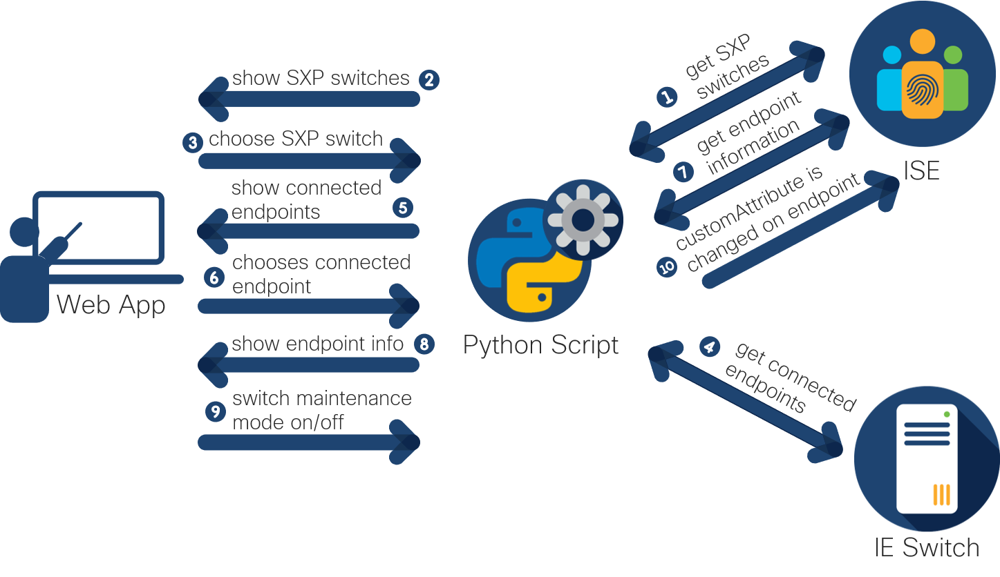
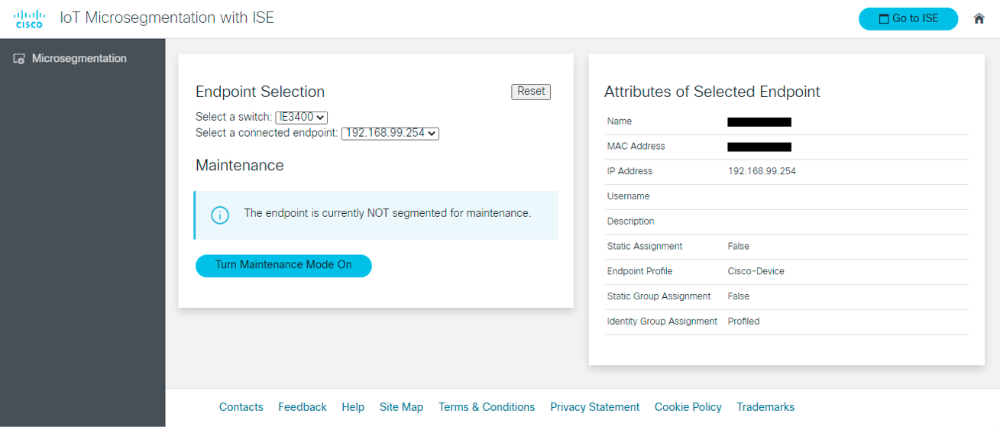

# IoT Microsegmentation with ISE for Secure Maintenance

A [simple interface](https://youtu.be/ooGLMDRbq3A) to microsegment machines in an OT environment for secure maintenance using [endpoint custom attributes](https://ciscocustomer.lookbookhq.com/iseguidedjourney/ISE-design-endpoint-attributes) in ISE. When an endpoint, i.e. a machine, is in maintenance mode, traffic is limited for the operator connecting to it so that he/she can perform maintenance work on the machine with reduced security and operational risks. 

## Workflow

1. The backend script collects all SXP switches from ISE.
2. The list of switches is displayed on the web app.
3. The user selects the switch to which the machine he/she wants to perform maintenance on is connected to.
4. The backend script connects to the switch and gets a list of connected endpoints, which are the machines. 
5. The list of endpoints connected to the switch is displayed on the web app.
6. The user selects the endpoint he/she wants to perform maintenance on. 
7. The backend script collects information on the chosen endpoint, incl. the list of customeAttribute. 
8. The endpoint information is displayed to the user, incl. the option to turn maintenance mode on or off. 
9. The user turns maintenance mode on or off. 
10. The backend script updates the customAttribute for the chosen endpoint. 

## Interface

## Contacts
* Jara Osterfeld (josterfe@cisco.com)

## Solution Components
* Python
* Cisco ISE
* Cisco Industrial Switching

## Prerequisites
- **ISE ERS APIs**: Enable ERS API access on ISE following the instructions [here](https://developer.cisco.com/docs/identity-services-engine/3.0/#!setting-up).
- **Configure Endpoint Custom Attributes on ISE**: Configure endpoint custom attributes for profiling in ISE following the instructions [here](https://ciscocustomer.lookbookhq.com/iseguidedjourney/ISE-design-endpoint-attributes). The application uses the custom attribute *assetProjectName* and gives it the value *maintenance* when maintenance mode is turned on.
- **SSH connectivity to IE switches**: The script requires SSH access to the IE switches to get a list of connected endpoints. 

## Installation

1. Clone this repository with `git clone <this repo>`.

2. Open the `credentials.yml` file and add the following information:
    
        ISE_instance: '' 
        ISE_username: ''
        ISE_password: ''
        switch_ssh_username: '' 
        switch_ssh_password: ''
        switch_ssh_enable_password: ''

3. (Optional) Create a Python virtual environment and activate it (find instructions [here](https://docs.python.org/3/tutorial/venv.html)).

4. In a terminal, install the requirements with `pip install -r requirements.txt`.

5. In a terminal, navigate to the root directory and start the Flask application by running `python main.py`. 

6. In a browser, go to `localhost:5001` to open the application. 

## License
Provided under Cisco Sample Code License, for details see [LICENSE](./LICENSE.md).

## Code of Conduct
Our code of conduct is available [here](./CODE_OF_CONDUCT.md).

## Contributing
See our contributing guidelines [here](./CONTRIBUTING.md).